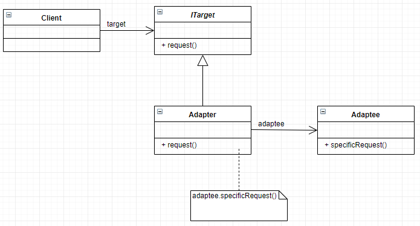

# Adapter Design Pattern

Adapter is a structural design pattern that allows objects with incompatible interfaces to collaborate. In other words, the adapter pattern makes two incompatible interfaces compatible without changing their existing code.

The adapter pattern is often used to make existing classes work with others without modifying their source code.

Adapter patterns use a single class (the adapter class) to join functionalities of independent or incompatible interfaces/classes.

This pattern converts the (incompatible) interface of a class (the adaptee) into another interface (the target) that clients require.

The adapter pattern also lets classes work together, which, otherwise, couldn't have worked, because of the incompatible interfaces.

The main motive behind using this pattern is to convert an existing interface into another interface that the client expects.

## UML class diagram

+ Target — This defines the domain-specific interface that the client uses.

+ Adapter — This adapts the interface from the adaptee to the target interface.

+ Adaptee — This defines an existing interface that needs adapting.

+ Client — This collaborates with objects conforming to the Target interface.

## To use an adapter:

1. The client makes a request to the adapter by calling a method on it using the target interface.

2. The adapter translates that request on the adaptee using the adaptee interface.

3. Client receive the results of the call and is unaware of adapter’s presence.

## When to use:

+ When an outside component provides captivating functionality that we'd like to reuse, but it's incompatible with our current application. A suitable Adapter can be developed to make them compatible with each other.

+ When our application is not compatible with the interface that our client is expecting.

+ When we want to reuse legacy code in our application without making any modification in the original code.

## Pros and Cons

+ Single Responsibility Principle. You can separate the interface or data conversion code from the primary business logic of the program.

+ Open/Closed Principle. You can introduce new types of adapters into the program without breaking the existing client code, as long as they work with the adapters through the client interface.

+ The overall complexity of the code increases because you need to introduce a set of new interfaces and classes. Sometimes it’s simpler just to change the service class so that it matches the rest of your code.

## Useful Links: 

https://www.youtube.com/watch?v=2PKQtcJjYvc

https://refactoring.guru/design-patterns/adapter
